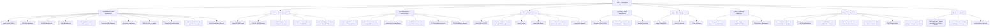

# Capability Map

This diagram shows the top-level functional capabilities of PIMS, organised by epic.

```mermaid
flowchart TD
    PIMS["PIMS — Post Import Management System"]

    PIMS --> CRM["Consignment Record Management"]
    PIMS --> EXT["External System Integration"]
    PIMS --> RISK["Risk Assessment & Business Rules"]
    PIMS --> POO["Place of Origin Trust Level"]
    PIMS --> PIC["Post Import Check Management"]
    PIMS --> QRY["Import Query Management"]
    PIMS --> GEO["Team & Geographic Assignment"]
    PIMS --> RPT["Reporting & Analytics"]
    PIMS --> AUD["Audit & Compliance"]

    CRM --> CRM1["Import Record CRUD"]
    CRM --> CRM2["ITAHC Management"]
    CRM --> CRM3["DOCOM Management"]
    CRM --> CRM4["CVED Management"]
    CRM --> CRM5["Import Notification Management"]
    CRM --> CRM6["Importer Notification View"]
    CRM --> CRM7["Document Attachment"]
    CRM --> CRM8["IV65 Due Date Calculation"]
    CRM --> CRM9["Completion Date Recording"]
    CRM --> CRM10["Warble Fly Declaration Tracking"]
    CRM --> CRM11["Quick Create Import Record"]

    EXT --> EXT1["TRACES ITAHC Ingest"]
    EXT --> EXT2["TRACES DOCOM Ingest"]
    EXT --> EXT3["IPAFFS Importer Notification Ingest"]
    EXT --> EXT4["Auto-Create Import Record from ITAHC"]
    EXT --> EXT5["Auto-Create Import Record from DOCOM"]

    RISK --> RISK1["Commodity Risk Level Rules"]
    RISK --> RISK2["Gold/Bronze Commodity Rules"]
    RISK --> RISK3["Inspection Coverage Rules"]
    RISK --> RISK4["P1 Post-Check Determination"]
    RISK --> RISK5["P2 10% Random Inspection"]
    RISK --> RISK6["P3 2% Random Inspection"]

    POO --> POO1["Place of Origin CRUD"]
    POO --> POO2["Trust Level Maintenance / (Gold/Bronze)"]
    POO --> POO3["Lock to Bronze"]
    POO --> POO4["Unlock from Bronze"]
    POO --> POO5["Gold Trust Level Revocation"]
    POO --> POO6["Counter Management"]

    PIC --> PIC1["Post Import Check CRUD"]
    PIC --> PIC2["Manual Override / (Skip / Schedule)"]
    PIC --> PIC3["Outcome Recording"]

    QRY --> QRY1["Import Query CRUD"]
    QRY --> QRY2["Query Assignment"]
    QRY --> QRY3["Query Resolution"]

    GEO --> GEO1["Geographic Team Assignment"]
    GEO --> GEO2["Auto-Assign ITAHC/DOCOM"]
    GEO --> GEO3["APHA Region Management"]

    RPT --> RPT1["Daily Huddle Stats Dashboard"]
    RPT --> RPT2["Daily Stats Dashboard"]
    RPT --> RPT3["Daily IRMS Stats Dashboard"]
    RPT --> RPT4["Border Control Metrics Dashboard"]
    RPT --> RPT5["APHA Border Control Metrics Dashboard"]
    RPT --> RPT6["FAET Weekly Report"]
    RPT --> RPT7["Inspection Coverage Audit Report"]

    AUD --> AUD1["Field-Level Audit / (Import Records & Post Import Checks)"]
    AUD --> AUD2["Unique Reference Number Generation"]
    AUD --> AUD3["Counter History Tracking"]
```

