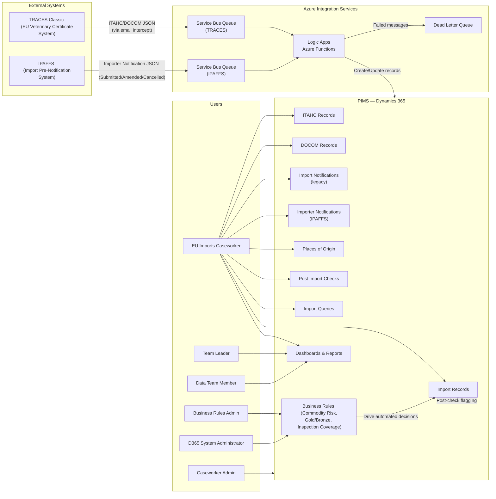

# Context Diagram

This diagram shows how PIMS interacts with external systems and user groups.

```mermaid
flowchart LR
    subgraph External_Systems["External Systems"]
        TRACES["TRACES Classic <br/> (EU Veterinary Certificate System)"]
        IPAFFS["IPAFFS <br/> (Import Pre-Notification System)"]
    end

    subgraph Azure_Integration["Azure Integration Services"]
        SBQ_TRACES["Service Bus Queue <br/> (TRACES)"]
        SBQ_IPAFFS["Service Bus Queue <br/> (IPAFFS)"]
        LA["Logic Apps <br/> Azure Functions"]
        DLQ["Dead Letter Queue"]
    end

    subgraph PIMS_D365["PIMS — Dynamics 365"]
        IMPORT_REC["Import Records"]
        ITAHC_ENT["ITAHC Records"]
        DOCOM_ENT["DOCOM Records"]
        IMP_NOT["Import Notifications <br/> (legacy)"]
        IMPR_NOT["Importer Notifications <br/> (IPAFFS)"]
        POO_ENT["Places of Origin"]
        PIC_ENT["Post Import Checks"]
        QRY_ENT["Import Queries"]
        RULES["Business Rules <br/> (Commodity Risk, Gold/Bronze, <br/> Inspection Coverage)"]
        DASH["Dashboards & Reports"]
    end

    subgraph Users["Users"]
        CW["EU Imports Caseworker"]
        CWA["Caseworker Admin"]
        BRA["Business Rules Admin"]
        TL["Team Leader"]
        DT["Data Team Member"]
        SYSADM["D365 System Administrator"]
    end

    TRACES -->|"ITAHC/DOCOM JSON <br/> (via email intercept)"| SBQ_TRACES
    IPAFFS -->|"Importer Notification JSON <br/> (Submitted/Amended/Cancelled)"| SBQ_IPAFFS

    SBQ_TRACES --> LA
    SBQ_IPAFFS --> LA
    LA -->|"Create/Update records"| PIMS_D365
    LA -->|"Failed messages"| DLQ

    CW --> IMPORT_REC
    CW --> ITAHC_ENT
    CW --> DOCOM_ENT
    CW --> IMP_NOT
    CW --> IMPR_NOT
    CW --> POO_ENT
    CW --> PIC_ENT
    CW --> QRY_ENT
    CW --> DASH

    CWA --> PIMS_D365
    BRA --> RULES
    TL --> DASH
    DT --> DASH
    SYSADM --> RULES

    PIMS_D365 -->|"Risk assessment <br/> Post-check flagging"| IMPORT_REC
    RULES -->|"Drive automated decisions"| IMPORT_REC
```

