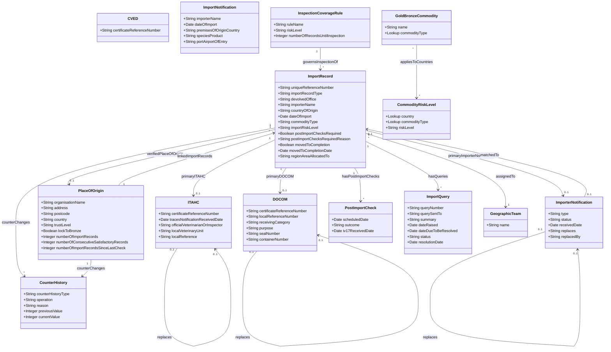

# Domain Model

This diagram shows the core entity relationships in PIMS.

```mermaid
classDiagram
    class ImportRecord {
        +String uniqueReferenceNumber
        +String importRecordType
        +String devolvedOffice
        +String importerName
        +String countryOfOrigin
        +Date dateOfImport
        +String commodityType
        +String importRiskLevel
        +Boolean postImportChecksRequired
        +String postImportChecksRequiredReason
        +Boolean movedToCompletion
        +Date movedToCompletionDate
        +String regionAreaAllocatedTo
    }

    class ITAHC {
        +String certificateReferenceNumber
        +Date tracesNotificationReceivedDate
        +String officialVeterinarianOrInspector
        +String localVeterinaryUnit
        +String localReference
    }

    class DOCOM {
        +String certificateReferenceNumber
        +String localReferenceNumber
        +String receivingCategory
        +String purpose
        +String sealNumber
        +String containerNumber
    }

    class CVED {
        +String certificateReferenceNumber
    }

    class ImportNotification {
        +String importerName
        +Date dateOfImport
        +String premisesOfOriginCountry
        +String speciesProduct
        +String portAirportOfEntry
    }

    class ImporterNotification {
        +String type
        +String status
        +Date receivedDate
        +String replaces
        +String replacedBy
    }

    class PlaceOfOrigin {
        +String organisationName
        +String address
        +String postcode
        +String country
        +String trustLevel
        +Boolean lockToBronze
        +Integer numberOfImportRecords
        +Integer numberOfConsecutiveSatisfactoryRecords
        +Integer numberOfImportRecordsSinceLastCheck
    }

    class PostImportCheck {
        +Date scheduledDate
        +String outcome
        +Date iv17ReceivedDate
    }

    class ImportQuery {
        +String queryNumber
        +String querySentTo
        +String summary
        +Date dateRaised
        +Date dateDueToBeResolved
        +String status
        +Date resolutionDate
    }

    class CommodityRiskLevel {
        +Lookup country
        +Lookup commodityType
        +String riskLevel
    }

    class GoldBronzeCommodity {
        +String name
        +Lookup commodityType
    }

    class InspectionCoverageRule {
        +String ruleName
        +String riskLevel
        +Integer numberOfRecordsUntilInspection
    }

    class CounterHistory {
        +String counterHistoryType
        +String operation
        +String reason
        +Integer previousValue
        +Integer currentValue
    }

    class GeographicTeam {
        +String name
    }

    ImportRecord "1" --> "0..1" ITAHC : primaryITAHC
    ImportRecord "1" --> "0..1" DOCOM : primaryDOCOM
    ImportRecord "1" --> "0..1" ImporterNotification : primaryImporterNotification
    ImportRecord "1" --> "0..1" PlaceOfOrigin : verifiedPlaceOfOrigin
    ImportRecord "1" --> "*" PostImportCheck : hasPostImportChecks
    ImportRecord "1" --> "*" ImportQuery : hasQueries
    ImportRecord "*" --> "1" GeographicTeam : assignedTo
    ImportRecord "1" --> "*" CounterHistory : counterChanges

    ITAHC "0..1" --> "0..1" ITAHC : replacedBy
    ITAHC "0..1" --> "0..1" ITAHC : replaces

    DOCOM "0..1" --> "0..1" DOCOM : replacedBy
    DOCOM "0..1" --> "0..1" DOCOM : replaces

    PlaceOfOrigin "1" --> "*" ImportRecord : linkedImportRecords
    PlaceOfOrigin "1" --> "*" CounterHistory : counterChanges

    GoldBronzeCommodity "*" --> "*" CommodityRiskLevel : appliesToCountries
    InspectionCoverageRule "1" --> "*" ImportRecord : governsInspectionOf
    ImporterNotification "0..1" --> "0..1" ImportRecord : matchedTo
    ImporterNotification "0..1" --> "0..1" ImporterNotification : replacedBy
    ImporterNotification "0..1" --> "0..1" ImporterNotification : replaces
```
