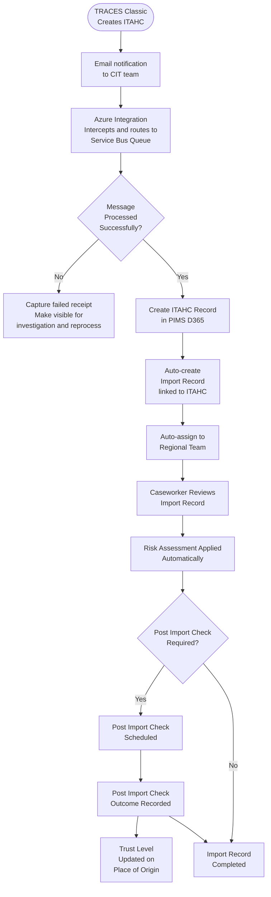
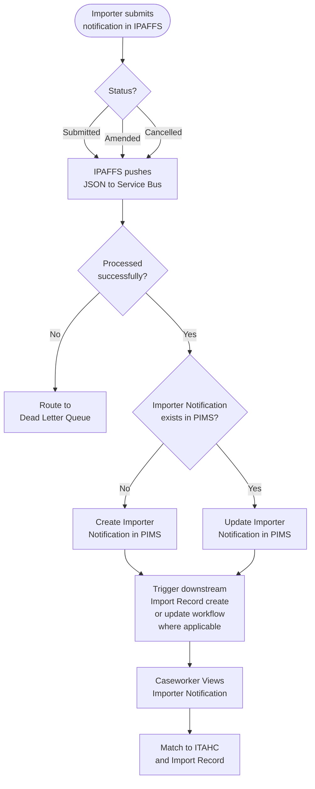
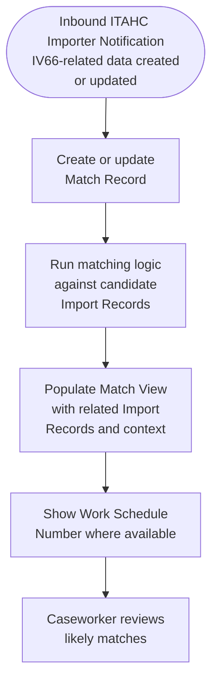
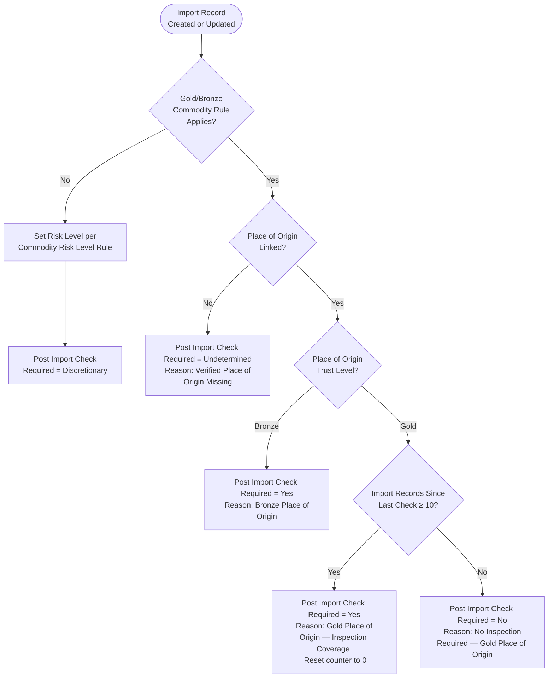
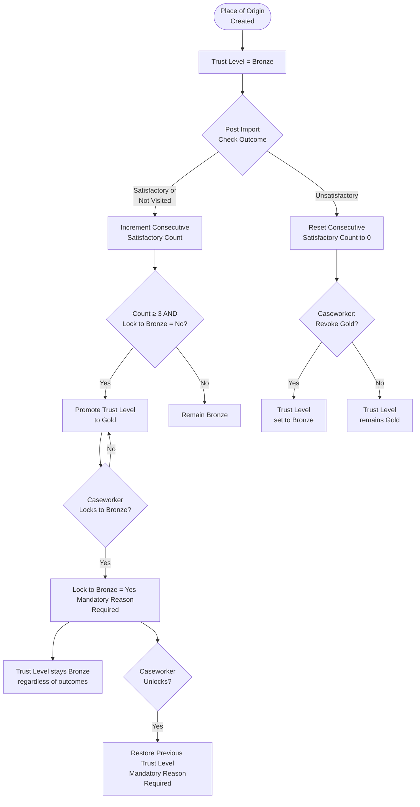
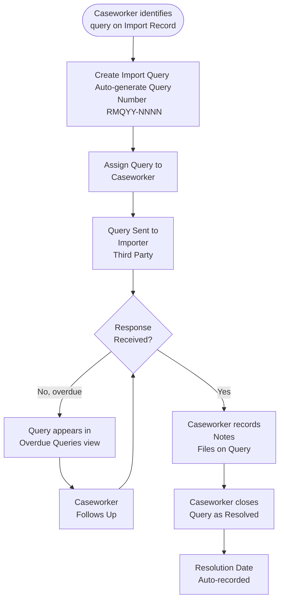

# Process Flows

Key process flows in PIMS, derived from the source Jira stories.

---

## Process 1 — TRACES ITAHC Ingest and Import Record Creation

---

## Process 2 — IPAFFS Importer Notification Receipt

---

## Process 6 — Match Inbound Records to Import Records

---

## Process 3 — Automated Risk Assessment (P1 Gold/Bronze)

---

## Process 4 — Place of Origin Trust Level Lifecycle

---

## Process 5 — Import Query Lifecycle

