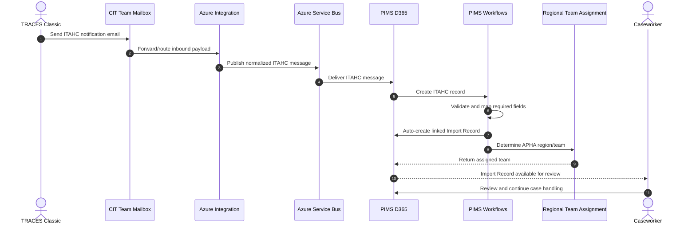
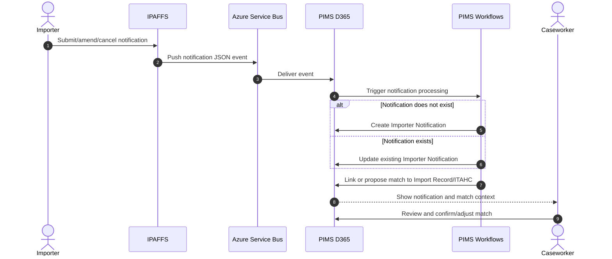
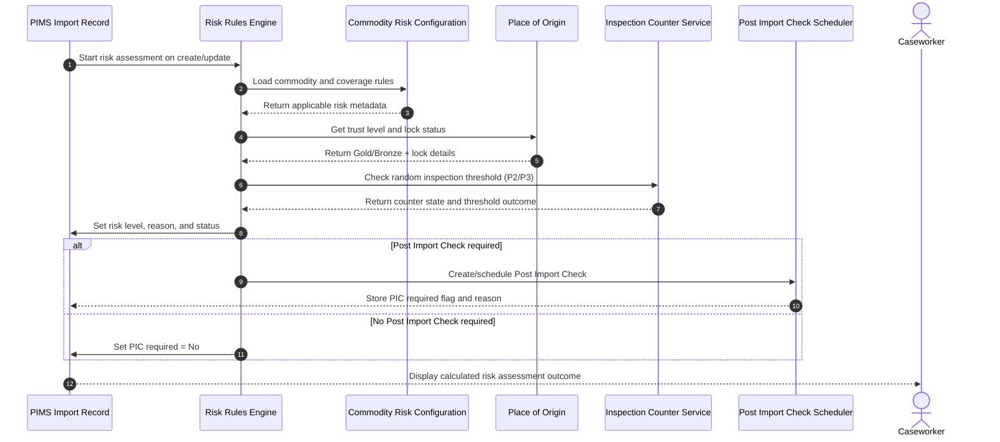
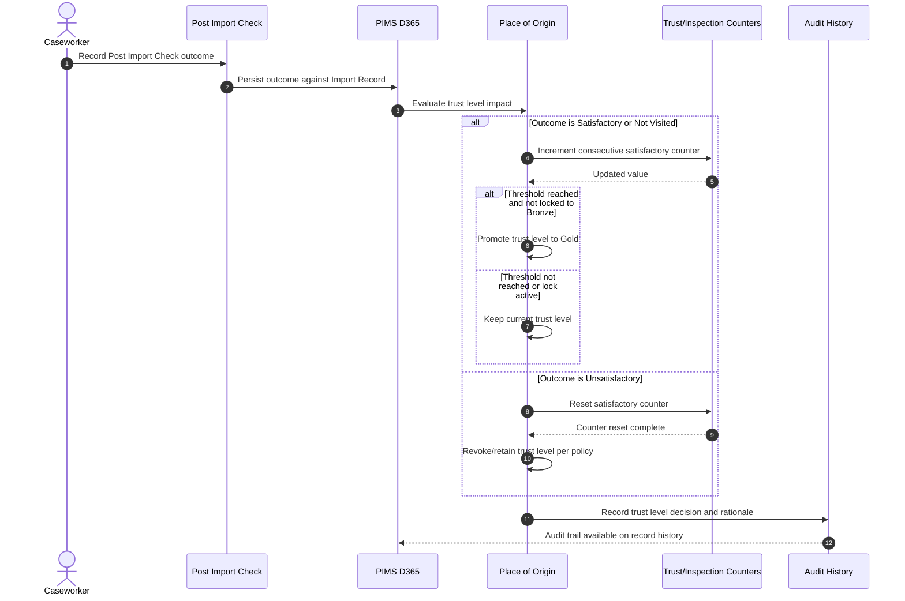
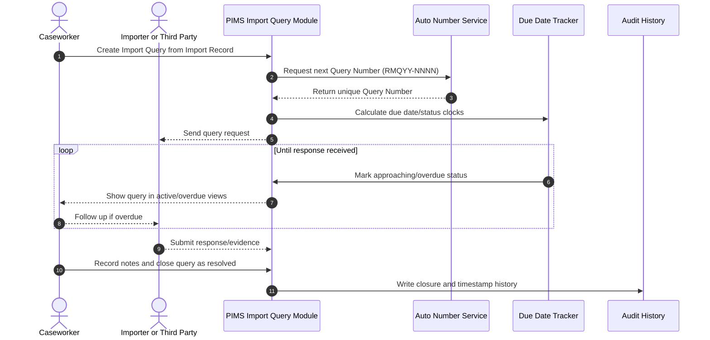
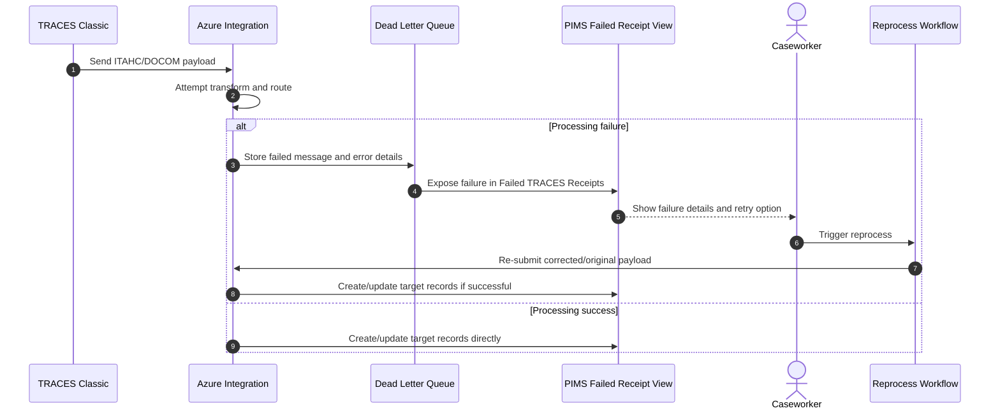

# Sequence Diagrams

End-to-end sequence diagrams for core PIMS processes. These complement the process flowcharts by showing message timing and actor interaction.

## Process 1 - TRACES ITAHC Ingest to Import Record Creation

## Process 2 - IPAFFS Importer Notification Receipt and Update

## Process 3 - Automated Risk Assessment and Inspection Decision

## Process 4 - Post Import Check Outcome and Trust Level Maintenance

## Process 5 - Import Query Lifecycle

## Process 6 - Failed TRACES Receipt Handling and Reprocessing

